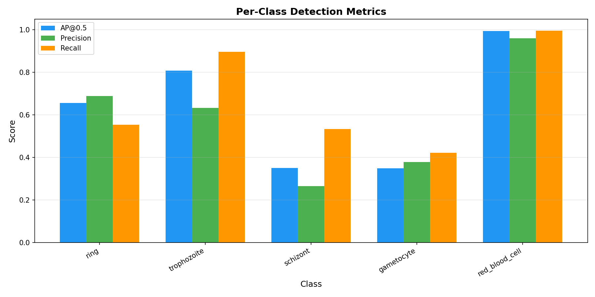
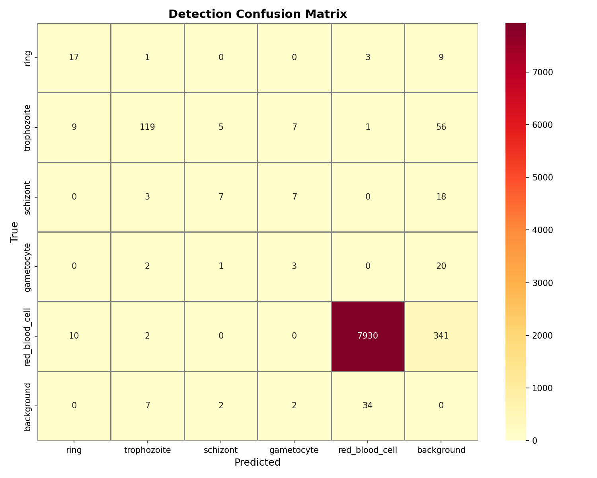

# 🔬 Malaria Parasite Detection System

> **AI-powered object detection of *Plasmodium vivax* parasites in blood smear
> microscopy images using YOLOv8: built for the NACOS UI × DATICAN 2026
> AI-in-Medicine Competition.**

[](https://www.python.org/downloads/)
[](https://docs.ultralytics.com/)
[](https://streamlit.io)
[](LICENSE)
[](https://malaria-ai-detection.streamlit.app/)

---

## 📋 Table of Contents

- [Project Overview](#-project-overview)
- [Problem Statement](#-problem-statement)
- [Key Design Decisions](#-key-design-decisions)
- [Dataset](#-dataset)
- [Architecture](#-architecture)
- [Clinical Workflow Features](#-clinical-workflow-features)
- [Setup & Installation](#-setup--installation)
- [Pipeline Walkthrough](#-pipeline-walkthrough)
- [Training](#-training)
- [Evaluation](#-evaluation)
- [Interactive Demo](#-interactive-demo)
- [Results](#-results)
- [Project Structure](#-project-structure)
- [Team](#-team)
- [License](#-license)
- [Acknowledgements](#-acknowledgements)


---


## 🎯 Project Overview

This system automates the detection and classification of malaria parasites in
Giemsa-stained thin blood smear microscopy images. It identifies four
life-cycle stages of *Plasmodium vivax*: ring, trophozoite, schizont, and
gametocyte, alongside healthy red blood cells, providing:

- **Parasite localisation** with bounding boxes and confidence scores
- **Parasitemia estimation** (% infected cells) for severity assessment,
  following WHO treatment guideline thresholds
- **Slide quality assessment** — blur, illumination, and exposure checks
  before inference runs, preventing garbage-in/garbage-out failures
- **Uncertainty flagging** — detections in the 35–45% confidence range are
  flagged for mandatory human review rather than auto-classified
- **Human-in-the-loop verification** — clinicians can accept or reject
  flagged detections; parasitemia and severity recalculate in real time
- **Batch processing mode** for analysing multiple slides at once
- **Clinical-grade PDF reports** with patient demographics, stage-specific
  clinical notes, and WHO-aligned recommendations
- **Interactive web demo** accessible from any browser, no GPU required

Built for the **NACOS UI × DATICAN 2026 AI-in-Medicine Competition** with a focus on practical clinical applicability, responsible AI deployment, and
real-world suitability for resource-limited African healthcare settings.

---

## 🏥 Problem Statement

Malaria kills over 600,000 people annually (WHO, 2023). Gold-standard
diagnosis requires manual microscopy by trained technicians, a critical
bottleneck in resource-limited settings where the disease burden is highest.

| Challenge | Impact |
|---|---|
| Manual counting is slow (~20 min/slide) | Delayed treatment |
| Inter-observer variability | Inconsistent diagnoses |
| Shortage of trained microscopists | Limited access to diagnosis |
| Multiple parasite stages | Requires expert-level morphology knowledge |

**Our solution:** An AI system that detects and classifies parasites in
seconds, providing consistent, explainable results to *assist* and not to replace
— human microscopists. Where the model is uncertain, it says so explicitly
rather than forcing a confident-looking but unreliable classification.

---

## 🏗 Key Design Decisions

| Decision | Rationale |
|---|---|
| **YOLOv8 over classification** | Detection localises individual parasites and enables parasitemia counting — a classifier cannot produce this number |
| **5-class detection** | Ring, trophozoite, schizont, gametocyte, and RBC each carry distinct clinical significance |
| **Uncertainty flagging** | Borderline detections are surfaced for human review rather than auto-classified, respecting clinical safety protocols |
| **CPU-only inference** | No GPU required — deployable in resource-limited African clinical settings on standard hardware |
| **Parasitemia estimation** | Infected cell ratio provides a quantitative severity metric aligned with WHO treatment guidelines |
| **Human-in-the-loop** | AI proposes, clinician disposes — verification decisions directly update all downstream clinical outputs |
| **Streamlit deployment** | Runs in any browser, no installation, fast to iterate — appropriate for a clinical tool targeting lab technicians |

---

## 📊 Dataset

**[BBBC041 — Malaria Bounding Boxes](https://bbbc.broadinstitute.org/BBBC041)**
from the Broad Bioimage Benchmark Collection, accessed via
[Kaggle](https://www.kaggle.com/datasets/khanhtq2101/bbbc041-detection).

| Property | Value |
|----------|-------|
| Images | ~1,364 blood smear fields |
| Resolution | 1600 × 1200 px |
| Format | PNG |
| Annotations | Bounding boxes |
| Staining | Giemsa (thin smear) |
| Species | *Plasmodium vivax* |
| Split | 1,087 train / 121 val / 120 test |

### Classes

| ID | Class | Training Examples | Description |
|----|-------|:-----------------:|-------------|
| 0 | `ring` | 317 | Early trophozoite (ring form) — most common stage |
| 1 | `trophozoite` | 1,339 | Mature feeding stage |
| 2 | `schizont` | 164 | Replicative stage with merozoites |
| 3 | `gametocyte` | 125 | Sexual stage (transmissible to mosquitoes) |
| 4 | `red_blood_cell` | 69,452 | Healthy/uninfected RBC |

> **Class imbalance note:** The extreme imbalance between RBC (69,452) and
> rare parasite stages (125–164) directly shapes model performance on
> schizont and gametocyte detection. This is a known characteristic of
> BBBC041, not a model architecture limitation. We address it operationally
> through uncertainty flagging and human-in-the-loop verification.

### ⚠️ A Note on Dataset Annotation Formats

During development we discovered the Kaggle-hosted BBBC041 mirror provides
multiple annotation variants with an important tradeoff:

| Folder | Coordinate Format | Classes |
|--------|-------------------|---------|
| `labels/` | Normalised (0–1) | Single-class (ring only) |
| `labels_without_leukocyte/` | Normalised (0–1) | Single-class (ring only) |
| `whole_pipeline_annotation_5class/` | Raw pixel coordinates | Full 5-class |

None of the provided variants combined full 5-class annotations with correctly
normalised coordinates. We wrote `normalize_labels.py` to convert the 5-class
pixel-coordinate annotations into YOLO's expected normalised format using each
image's known 1600×1200 dimensions. Training on un-normalised coordinates
causes YOLOv8 to silently reject every image as "corrupt" with a misleading
error message — a failure mode that cost real debugging time before the root
cause was identified.

---

┌─────────────────────────────────────────────────────┐
│              CLINICAL WORKFLOW PIPELINE              │
└─────────────────────────────────────────────────────┘

  📋 Patient Intake          Report number, demographics
         │
         ▼
  🔍 Slide Quality Check     Blur · Brightness · Exposure
         │
         ▼
  🧠 YOLOv8 Detection        5-class parasite localisation
         │
         ▼
  ⚠️  Uncertainty Flagging   35–45% confidence → human review
         │
         ▼
  👨‍⚕️ Clinician Verification  Accept / Reject flagged detections
         │
         ▼
  📊 Parasitemia Estimation  Infected cells ÷ total cells × 100
         │
         ▼
  🏥 WHO Severity Class.     Low · Moderate · Severe thresholds
         │
         ▼
  📄 Clinical PDF Report     Interpretation · Notes · Recommendations

---
**Model:** YOLOv8n (Ultralytics) with COCO pre-trained weights for transfer
learning. Nano variant chosen for CPU-friendly inference (~140ms/image) over
larger variants requiring GPU — prioritising deployability in resource-limited
settings over marginal accuracy gains.

**Why YOLO over classification?**
- Detection localises individual parasites and counts them — essential for
  parasitemia calculation
- Strong small-object detection (parasites are tiny relative to the field of
  view)
- One-stage detector — simpler deployment than two-stage pipelines
- Real-time inference speed suitable for clinical screening workflows

---

## 🩺 Clinical Workflow Features

Beyond detection, the system implements a full clinical decision-support
workflow designed around real laboratory practice.

### Patient Intake
Optional session-based patient information form — name, age, sex, sample ID,
requesting clinician, and health facility. Each analysis auto-generates a
unique **Report Number** (e.g. `RPT-20260628-68579`) and **Study ID**
(e.g. `STD-BD101`). No data is persisted beyond the browser session; nothing
is written to a server or database.

### Slide Quality Assessment
Before inference runs, the system checks the uploaded image for common
microscopy quality issues using classical computer vision — no ML model
involved. Thresholds are calibrated against empirical analysis of 30 actual
BBBC041 test images:

| Check | Method | Error Threshold | Warning Threshold |
|-------|--------|----------------|-------------------|
| Blur | Laplacian variance | < 2.0 | < 2.7 |
| Darkness | Mean pixel intensity | < 100/255 | < 130/255 |
| Overexposure | Saturated pixel % | > 25% | > 15% |

Severe issues block analysis with specific actionable guidance (refocus the
microscope, adjust illumination). Moderate issues show advisory warnings that
allow the user to proceed with caution. A clean pass shows a positive
confirmation before analysis begins.

### 👨🏽‍⚕️ Human-in-the-Loop Verification
Detections with confidence between **35–45%** are flagged as *Inconclusive*
and presented as individual zoomed crops with **Accept** / **Reject**
controls. All clinical outputs recalculate in real time:
Uncertain detection flagged

↓

Clinician reviews zoomed crop + stage-specific morphology notes

↓

Accept → counted as confirmed parasite

Reject → excluded from parasite count

↓

Parasitemia, severity, and recommendation recalculate immediately

Unreviewed uncertain detections default to *accepted* (conservative — in
clinical screening, missing a real infection is more dangerous than a false
positive a microscopist can dismiss).

### 📄 Clinical PDF Report
Every analysis generates a downloadable report structured like a real
laboratory document:

- **Patient information table** — demographics, sample ID, clinician,
  facility, report number, study ID, timestamp
- **Clinical interpretation paragraph** — dynamically generated based on
  parasitemia level and dominant stage
- **Stage-specific clinical notes** — explains what each detected stage means
  clinically (ring = early infection; schizont in peripheral blood = higher
  severity concern; gametocyte = epidemiological transmission risk)
- **Numbered recommendation checklist** — WHO-aligned treatment guidance
- **Annotated image** with all AI-proposed detections
- **Disclaimer** — explicit statement that this is AI-assisted screening
  requiring confirmation by a qualified microscopist

When human-in-the-loop verification has occurred, the report is clearly
labelled **[Clinician-Verified]** and the detection table reflects reviewed
counts, not raw model output.

### 📊 Batch Processing
Analyse multiple slides in a single session. A progress bar updates as each
image is processed. Results export as a downloadable CSV summary with
per-slide parasite count, uncertain detections, parasitemia percentage, and
positive/negative status.

### 📈 Detailed Analysis Charts
An expandable section below each analysis result contains:
- **Confidence distribution bar chart** — high confidence vs uncertain vs RBC
  detections
- **Per-class parasite breakdown** — horizontal bar chart
- **Parasitemia gauge** — semicircular indicator with WHO threshold markers
  at 1% (low) and 5% (severe)

---

## ⚙️ Setup & Installation

### Prerequisites
- Python 3.10+
- Git
- (Optional) NVIDIA GPU with CUDA for faster training

### Steps

```bash
# 1. Clone the repository
git clone https://github.com/King-Gabby/malaria-ai-detection.git
cd malaria-ai-detection

# 2. Create virtual environment
python -m venv venv
source venv/bin/activate  # macOS/Linux
# venv\Scripts\activate   # Windows

# 3. Install dependencies
pip install -r requirements.txt

# 4. Download the dataset via kagglehub
python3 -c "
import kagglehub
path = kagglehub.dataset_download('khanhtq2101/bbbc041-detection')
print('Downloaded to:', path)
"

# 5. Copy dataset into project
mkdir -p data/raw/malaria
cp -r <path>/BBBC041_detection/images data/raw/malaria/
cp -r <path>/BBBC041_detection/whole_pipeline_annotation_5class \
       data/raw/malaria/labels_raw

# 6. Normalise annotations from pixel coordinates to YOLO format
python normalize_labels.py
# Output: data/raw/malaria/labels/{train,val,test}/
```

> **Why normalize_labels.py?** See the
> [Dataset Annotation Formats](#️-a-note-on-dataset-annotation-formats)
> section above. This step is essential — skipping it causes YOLOv8 to
> silently reject all training images as corrupt.

---

## 🔄 Pipeline Walkthrough

### 1. Annotation Normalisation

The core pipeline step unique to this project:

```bash
python normalize_labels.py
# Reads:  data/raw/malaria/labels_raw/{train,val,test}/*.txt (pixel coords)
# Writes: data/raw/malaria/labels/{train,val,test}/*.txt (normalised 0-1)
# Uses:   known image dimensions 1600×1200 for all BBBC041 images
```

### 2. Optional Preprocessing

```bash
python -m src.preprocessing.preprocess \
    --input_dir data/raw/malaria/images/train \
    --output_dir data/processed/train \
    --normalize_stain \
    --apply_clahe \
    --target_size 640
```

> Preprocessing is optional — YOLOv8's built-in augmentations (mosaic, HSV
> jitter) already provide robustness. Use stain normalisation if test images
> come from a different microscope/lab than the training data.

---

## 🏋️ Training

```bash
# Quick verification run (CPU, 10 epochs)
python -m src.training.train --model nano --epochs 10

# Full training run (used for final submission weights)
python -m src.training.train --model nano --epochs 50

# Resume interrupted training
python -m src.training.train \
    --model runs/train/malaria_detection/weights/last.pt \
    --epochs 50 \
    --resume
```

**Model size guide:**

| Model | Params | CPU Speed | Use Case |
|-------|--------|-----------|----------|
| `nano` | 3.2M | ~140ms/img | Final submission — CPU deployable |
| `small` | 11.2M | ~280ms/img | Better accuracy, still CPU feasible |
| `medium` | 25.9M | ~400ms/img | Requires GPU for practical training |

> **CPU training note:** All training for this project was completed on an
> Intel Core i5-7267U CPU (no GPU). 50 epochs took approximately 14 hours.
> Use `caffeinate -dims &` on macOS to prevent sleep during overnight runs.
> `last.pt` is saved after every epoch, enabling safe resumption after
> interruption.

---

## 📈 Evaluation

```bash
# Evaluate on test set
python -m src.evaluation.evaluate \
    --weights models/best.pt \
    --data configs/malaria.yaml \
    --output_dir results \
    --split test
```

**Outputs** (saved to `results/`):
- `metrics.json` — mAP, precision, recall (overall + per-class)
- `confusion_matrix.png` — Detection confusion matrix heatmap
- `per_class_metrics.png` — Bar chart of AP50, precision, recall by class
- `summary_card.png` — Quick-reference metrics card

---

## 🖥 Interactive Demo

```bash
streamlit run app/streamlit_app.py
```

**Live version:** [malaria-ai-detection.streamlit.app](https://malaria-ai-detection.streamlit.app/)

**Features:**
- 🩺 Optional patient intake form with auto-generated report and study IDs
- 🔍 Automated slide quality assessment before inference (blur, brightness,
  exposure)
- 📤 Upload a blood smear image, or try one of three bundled sample images
- 🎯 Real-time AI-powered detection with adjustable sensitivity and NMS
  thresholds
- ⚠️ Uncertainty flagging — borderline detections highlighted for human
  review
- ✅ Human-in-the-loop verification — accept/reject uncertain detections,
  parasitemia recalculates immediately
- 📦 Batch processing mode — analyse multiple slides at once, download CSV
  summary
- 🔬 Detection close-up gallery — zoomed crops of each detected parasite
- 📊 Parasitemia estimation with WHO-guideline severity classification
- 📈 Detailed analysis charts — confidence distribution, per-class breakdown,
  parasitemia gauge
- 🩺 AI Screening Summary card with dynamic clinical recommendation
- 📄 Downloadable clinical-grade PDF report (patient details, clinical
  interpretation, stage notes, recommendations), CSV data, annotated image
- 🎛 Toggle healthy RBC visibility for cleaner visualisation
- ⏱️ Live inference timing per analysis

---

## 📊 Results

Evaluated on the BBBC041 test set using the final trained model (YOLOv8n,
50 epochs, 5-class detection, CPU-only training).

| Metric | Value |
|--------|-------|
| mAP@0.5 | 63.1% |
| mAP@0.5:0.95 | 53.4% |
| Precision (avg) | 58.4% |
| Recall (avg) | 67.9% |
| Inference speed | ~140ms/image (CPU, no GPU required) |

### Per-Class Performance

| Class | AP@0.5 | Precision | Recall | Notes |
|-------|-------:|----------:|-------:|-------|
| Ring | 65.5% | 68.9% | 55.3% | Most common stage |
| Trophozoite | 80.8% | 63.1% | 89.6% | Strongest parasite class |
| Schizont | 35.0% | 26.4% | 53.3% | Only 164 training examples |
| Gametocyte | 34.8% | 37.7% | 42.1% | Only 125 training examples |
| Red Blood Cell | 99.3% | 95.9% | 99.4% | Near-perfect detection |

### Notes

- Weaker performance on schizont and gametocyte is directly attributable to
  dataset imbalance: 125–164 annotations versus 69,452 for red blood cells.
  This is a known characteristic of BBBC041, not a model architecture
  limitation.
- We address this operationally: uncertainty flagging surfaces low-confidence
  detections of rare stages for human review; human-in-the-loop verification
  allows clinicians to confirm or reject borderline findings before results
  are finalised.
- We optimised slightly more for **recall over precision** (67.9% vs 58.4%)
  — missing a real parasite is clinically more dangerous than a false
  positive a microscopist can dismiss.
- Future improvements: additional annotated examples for rare parasite stages,
  dataset balancing, evaluation on *P. falciparum* for broader applicability.

### Evaluation Outputs




---

## 📁 Project Structure
malaria-ai-detection/

├── app/

│   ├── streamlit_app.py            # Interactive web demo + full clinical

│   │                               # workflow (patient intake, quality check,

│   │                               # verification, reports, charts)

│   └── samples/                    # Bundled sample images for the demo

├── src/

│   ├── data/

│   │   ├── download_dataset.py     # Dataset download utilities

│   │   └── convert_annotations.py  # BBBC041 JSON → YOLO .txt

│   ├── preprocessing/

│   │   └── preprocess.py           # Stain normalisation, CLAHE, resize

│   ├── training/

│   │   └── train.py                # YOLOv8 training script, --resume support

│   ├── evaluation/

│   │   └── evaluate.py             # Metrics, confusion matrix, plots

│   └── inference/

│       └── predict.py              # Inference API, uncertainty tiers,

│                                   # parasitemia calculation, timing
├── models/

│   └── best.pt                     # Trained weights (committed for Streamlit

│                                   # Cloud deployment, 6.2MB stripped)

├── configs/

│   └── malaria.yaml                # YOLO dataset config (5 classes)

├── normalize_labels.py             # Converts BBBC041 pixel-coordinate

│                                   # annotations to normalised YOLO format

│                                   # (essential — see Dataset section)

├── results/                        # Evaluation outputs

│   ├── metrics.json

│   ├── confusion_matrix.png

│   ├── per_class_metrics.png

│   └── summary_card.png

├── notebooks/                      # EDA, experimentation

├── tests/

│   ├── test_convert_annotations.py

│   └── test_preprocess.py
├── requirements.txt                # Pinned dependencies

├── runtime.txt                     # Python 3.11 (Streamlit Cloud)

├── README.md

└── .gitignore
---

## 👥 Team

| Name | Role |
|------|------|
| Gabriel Akoleaje | Project Lead / Model Training / Data Pipeline / Inference |
| Treasure Olajide | Streamlit UI / Demo / Clinical Workflow |
| Sodiq Gbadegesin | Evaluation / Documentation / Testing |

**Competition:** NACOS UI × DATICAN 2026 — Undergraduate Students'
Competition in the Application of Artificial Intelligence in Medicine,
University of Ibadan in partnership with DATICAN.

---

## 📄 License

This project is licensed under the MIT License — see [LICENSE](LICENSE) for
details.

### Dataset License
The BBBC041 dataset is provided by the Broad Institute under
[CC BY-NC-SA 3.0](https://creativecommons.org/licenses/by-nc-sa/3.0/).
Images from: Hung & Bhatt, *Determining Parasites in Giemsa-stained Thick
Blood Smears* (BBBC). Note: this dataset's non-commercial license applies to
the underlying data and trained model weights; this repository's MIT license
covers the original source code only.

---

## 🙏 Acknowledgements

- [Broad Bioimage Benchmark Collection (BBBC)](https://bbbc.broadinstitute.org/)
  for the BBBC041 dataset
- [Ultralytics](https://docs.ultralytics.com/) for the YOLOv8 framework
- World Health Organization, malaria diagnostic guidelines and parasitemia
  severity thresholds
- Professor Onifade, Professor Akinola, and all Computer Science and Medical
  faculty at the University of Ibadan, Oyo State
