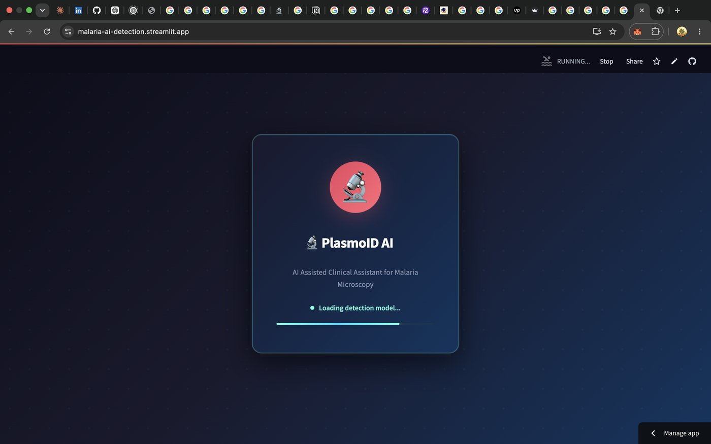
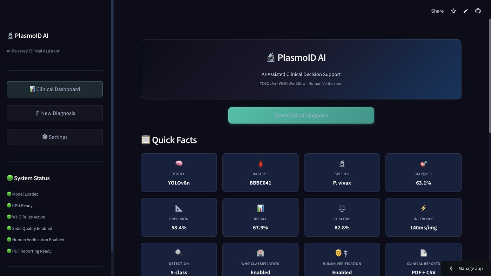
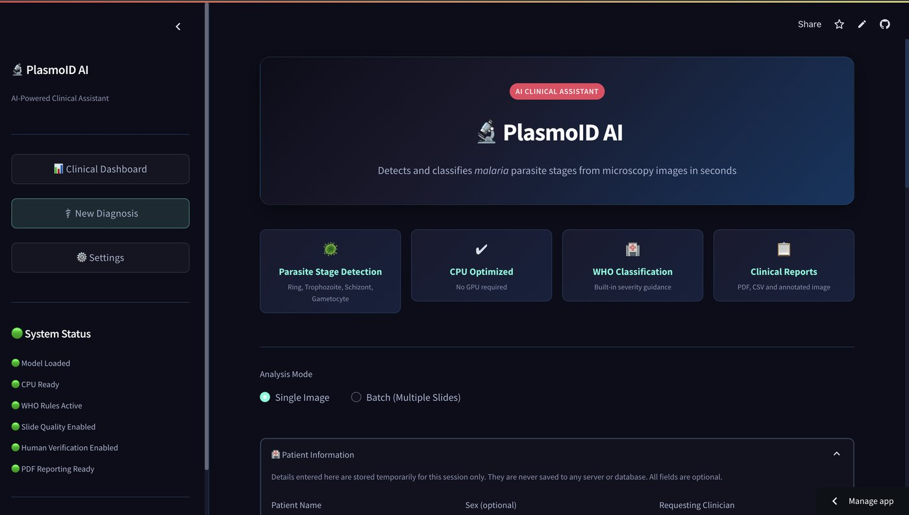
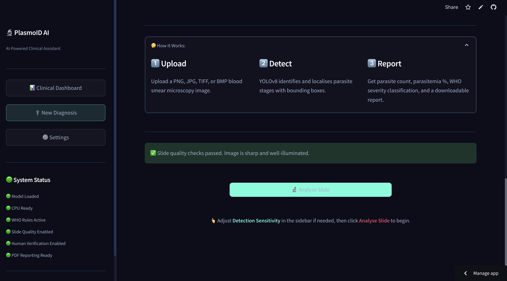
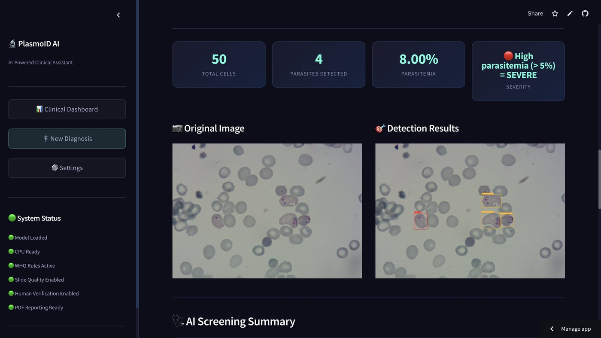
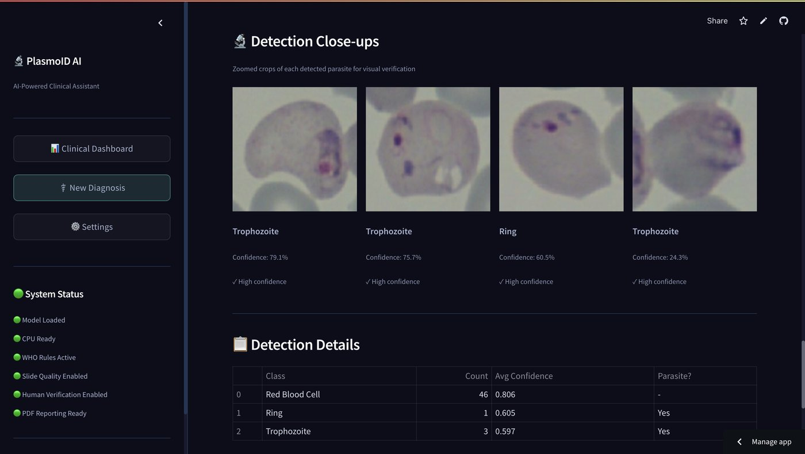
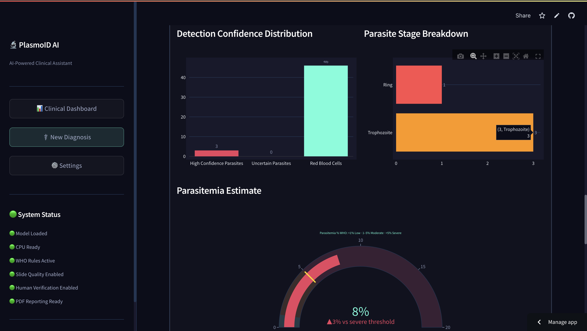
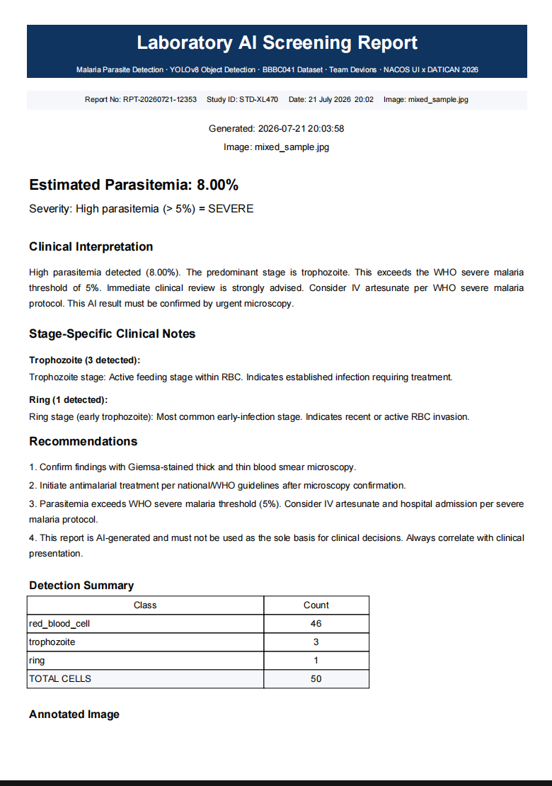

# 🦠 PlasmoID AI

### AI-Assisted Clinical Decision Support for Malaria Microscopy

PlasmoID AI is an automated clinical decision-support system designed to assist microscopists in detecting, localising, and classifying malaria parasites in Giemsa-stained thin blood smear microscopy images. By identifying four key life-cycle stages of *Plasmodium vivax* alongside healthy red blood cells, the system estimates parasitemia percentages and determines severity levels according to World Health Organization (WHO) clinical thresholds. Built for low-resource healthcare environments, PlasmoID AI combines CPU-optimized YOLOv8n inference with automated quality control checks and a clinician-in-the-loop verification panel.

---

<!-- Replace competition badge with Research Project badge after competition -->
[](https://www.python.org/downloads/)
[](https://docs.ultralytics.com/)
[](https://streamlit.io)
[](LICENSE)
[](https://malaria-ai-detection.streamlit.app/)
[](https://datican.org)
[](https://github.com/King-Gabby/malaria-ai-detection)

---

## 📋 Table of Contents

- [Highlights](#-highlights)
- [Why PlasmoID AI?](#-why-plasmoid-ai)
- [Clinical Workflow](#-clinical-workflow)
- [Architecture](#-architecture)
- [🎥 Demo](#-demo)
- [Application Walkthrough](#-application-walkthrough)
- [Features](#-features)
- [Technology Stack](#-technology-stack)
- [Problem Statement](#-problem-statement)
- [Key Design Decisions](#-key-design-decisions)
- [Dataset](#-dataset)
- [Internal Data Pipeline](#-internal-data-pipeline)
- [Setup & Installation](#-setup--installation)
- [Pipeline Walkthrough](#-pipeline-walkthrough)
- [Training](#-training)
- [Evaluation](#-evaluation)
- [Interactive Demo](#-interactive-demo)
- [Results](#-results)
- [Repository Structure](#-repository-structure)
- [Future Work](#-future-work)
- [Team](#-team)
- [License](#-license)
- [Acknowledgements](#-acknowledgements)

---

## ✨ Highlights

* **Automated Stage Detection**: Detects malaria parasites and classifies them into four key life-cycle stages (*ring*, *trophozoite*, *schizont*, and *gametocyte*) plus healthy red blood cells.
* **Human-in-the-Loop Verification**: Surfaces borderline detections (35–45% confidence) for clinical accept/reject review to protect clinical safety.
* **WHO Severity Classification**: Calculates estimated parasitemia percentages and classifies infection severity into Low (<1%), Moderate (1-5%), or Severe (>5%) categories.
* **CPU-Only Deployment**: Optimized to execute on standard consumer-grade CPU hardware (~140ms/image) without requiring expensive GPU infrastructure.
* **Clinical PDF & CSV Reports**: Exports verified diagnostics including patient demographics, morphologic observations, and WHO-aligned recommendations.
* **Slide Quality Assessment**: Employs classical computer vision checks (blur, illumination, and exposure) before running model inference to ensure diagnostic reliability.
* **Resource-Friendly Design**: Tailored specifically for healthcare environments with limited connectivity and hardware access.

---

## 🔬 Why PlasmoID AI?

Unlike typical computer vision demonstrators that stop at drawing boxes on raw images, PlasmoID AI is engineered as an end-to-end clinical decision-support system. It integrates key operational safety nets and workflow layers crucial for real-world laboratory workflows: slide quality assessment, automated parasite localisation, human-in-the-loop verification, parasitemia estimation, WHO severity classification, and clinical report generation. 

By design, it does not replace the microscopist; rather, it acts as an intelligent assistant. Detections falling within the model's zone of uncertainty (35–45% confidence) are flagged for clinician review, allowing humans to guide the AI when predictions are borderline. The final outputs—including the severity metrics, parasitemia percentage counts, and downloadable reports—dynamically adjust based on these clinical decisions. This makes PlasmoID AI highly applicable to resource-limited clinics where diagnostic reliability, speed, and safety are of paramount concern.

---

## 🔄 Clinical Workflow

Every microscopy field submitted to the application is processed through a structured diagnostic pipeline:

```text
       Upload Blood Smear
                │
                ▼
     Slide Quality Assessment
                │
                ▼
         YOLOv8 Detection
                │
                ▼
        Human Verification
                │
                ▼
      Parasitemia Estimation
                │
                ▼
        WHO Classification
                │
                ▼
          Clinical Report
```

### Detailed Workflow Walkthrough

* **Patient Intake & Demographics**: The clinician registers optional session-based patient demographics (Name, Age, Sex, facility details) which automatically generates a unique Report Number (e.g. `RPT-20260628-68579`) and Study ID (e.g. `STD-BD101`).
* **Slide Quality Assessment**: Before running machine learning models, classical computer vision checks compute blur (Laplacian variance), illumination, and exposure levels to ensure the image meets microscopy requirements.
* **YOLOv8n Parasite Detection**: The model predicts bounding boxes, confidence values, and cell types across 5 classes (healthy RBCs, rings, trophozoites, schizonts, and gametocytes).
* **Uncertainty Flagging**: Detections with confidence values falling within the 35–45% range are marked as inconclusive and flagged for clinicians.
* **Human-in-the-Loop Review**: Zoomed crops of flagged objects are displayed for confirmation. The user clicks **Accept** (counts as parasite) or **Reject** (reclassified or excluded). Unreviewed items default to accepted for safety.
* **WHO Classification & Reporting**: A clinical summary, severity, and stage indications are compiled into a print-ready PDF and a downloadable CSV of cell counts.

---

## 🏗 Architecture

The following diagram outlines the high-level diagnostic data flow and processing steps within PlasmoID AI:

```text
 Blood Smear Image
         │
         ▼
 Slide Quality Assessment
         │
         ▼
    YOLOv8n Detection
         │
         ▼
 Human Verification
         │
         ▼
 Parasitemia Estimation
         │
         ▼
 WHO Classification
         │
         ▼
 Clinical PDF / CSV Report
```

---

## 🎥 Demo

A short demonstration GIF showcasing the complete workflow will be added after the competition submission.

The demo will include:

- Splash screen
- Dashboard
- Image upload
- Parasite detection
- Human verification
- WHO classification
- PDF report generation

---

## 🖼 Application Walkthrough

PlasmoID AI is not merely a parasite detector — it is a **complete clinical decision-support workflow** that guides a laboratory technician from patient registration through slide quality gating, AI-powered detection, uncertainty-driven human verification, and finally to a WHO-classified, downloadable clinical report.

---

### Step 1 — Splash Screen & System Initialisation

> On launch, the system performs a self-check: the YOLOv8n model is loaded into memory, all quality-control modules are activated, WHO classification rules are applied, and PDF reporting is confirmed ready. All six status indicators must be green before analysis is permitted.



---

### Step 2 — Clinical Dashboard

> The main dashboard orients the clinician within the full three-stage workflow (Upload → Detect → Report) and provides quick access to **New Diagnosis** and the **Clinical Dashboard** for session history. The real-time System Status sidebar confirms model and infrastructure readiness at a glance.



---

### Step 3 — Patient Intake & Image Upload

> The clinician enters optional but recommended patient demographics (name, age, sex, facility). The system automatically generates a unique **Report Number** and **Study ID** for traceability. The technician then uploads a Giemsa-stained thin blood smear image or selects from three curated sample slides (Infected, Mixed, Healthy).



---

### Step 4 — Slide Quality Check

> Before any inference is run, classical computer vision algorithms evaluate the uploaded field for **focus sharpness** (Laplacian variance), **illumination uniformity**, and **exposure level**. A green confirmation banner is required to proceed — blurred or poorly lit slides are blocked with actionable guidance, protecting diagnostic reliability.



---

### Step 5 — YOLOv8 Parasite Detection

> The CPU-optimised YOLOv8n model analyses the slide field in ~140ms, producing bounding boxes with confidence scores across five classes: *ring*, *trophozoite*, *schizont*, *gametocyte*, and healthy red blood cells. Results are displayed as a side-by-side comparison — the original slide alongside the fully annotated detection output — with summary statistics (total cells, parasites detected, parasitemia %, and WHO severity) shown at the top.



---

### Step 6 — Clinician Verification Panel

> Detections with confidence scores in the **35–45% uncertainty band** are surfaced as zoomed crops for mandatory clinical accept/reject review. Each crop card displays the predicted class, confidence score, and a classification tier label. The clinician's decisions feed directly back into the parasitemia calculation and WHO severity determination — the AI proposes; the clinician disposes.



---

### Step 7 — Analytics & Severity Estimation

> A rich analytics panel presents **detection confidence distribution**, **parasite stage breakdown** (ring vs. trophozoite), and a **WHO parasitemia gauge** calibrated to the three severity thresholds: Low (<1%), Moderate (1–5%), and Severe (>5%). These visualisations give the clinician an at-a-glance understanding of infection burden and confidence in the model's outputs.



---

### Step 8 — Clinical Report Generation

> The completed diagnostic session is compiled into a **print-ready Laboratory AI Screening Report** (PDF) containing: the patient's demographic data, report and study identifiers, estimated parasitemia percentage, WHO severity classification, stage-specific clinical interpretations, evidence-based treatment recommendations, a full detection summary table, the annotated slide image, and a mandatory AI disclaimer. CSV and annotated image exports are also available.



---


## 🛠 Features

### Clinical
* **WHO-Aligned Severity**: Maps estimated parasitemia percentages directly to WHO treatment guidelines.
* **Stage-Specific Interpretations**: Generates custom warnings and diagnostic explanations depending on the life-cycle stages observed.
* **Demographic Association**: Links diagnostic results with basic clinician-entered patient intake details.

### AI Detection
* **Real-Time YOLOv8**: Processes Giemsa-stained thin blood smear fields on standard CPU hardware in ~140ms.
* **Interactive Adjustments**: Allows lab technicians to configure confidence (sensitivity) and intersection-over-union (NMS) thresholds.

### Reports
* **Clinician-Verified PDF**: Laboratory-grade report detailing cell tallies, morphologic annotations, patient intake, and disclaimers.
* **Raw CSV Data Export**: Downloads tabular detection coordinates, confidence bounds, and stage classes.
* **Annotated Smear Save**: Exports high-resolution diagnostic images showing predicted bounding boxes.

### Verification
* **Crop Gallery**: Collects close-ups of detected cells, automatically sorting inconclusive detections to the top.
* **Live Recalculation**: Adjusting accept/reject states immediately recalculates cell ratios and severity categories.

### Quality Control
* **Laplacian Variance Focus Analysis**: Evaluates focus sharpness to prevent scanning highly blurred fields.
* **Luminance Profiling**: Blocks or warns on under-illuminated or overexposed fields.

### Batch Processing
* **Multi-Slide Upload**: Analyzes directories of images sequentially.
* **Consolidated Data Summaries**: Generates multi-slide results tables with download options.

---

## 💻 Technology Stack

| Layer | Technology | Purpose |
|---|---|---|
| **Frontend** | Streamlit 1.40 | Web interface and responsive dashboard |
| **Model** | YOLOv8n | Real-time object detection and classification |
| **CV** | OpenCV | Image decoding, color-space mapping, and quality checks |
| **Visualization** | Plotly | Dynamic diagnostic graphs and confidence gauges |
| **Reports** | FPDF2 | Lab-grade PDF report rendering |
| **Language** | Python 3.10+ | Core application logic and execution engine |

---

## 🏥 Problem Statement

Malaria kills over 600,000 people annually (WHO, 2023). Gold-standard diagnosis requires manual microscopy by trained technicians, a critical bottleneck in resource-limited settings where the disease burden is highest.

| Challenge | Impact |
|---|---|
| Manual counting is slow (~20 min/slide) | Delayed treatment |
| Inter-observer variability | Inconsistent diagnoses |
| Shortage of trained microscopists | Limited access to diagnosis |
| Multiple parasite stages | Requires expert-level morphology knowledge |

**Our solution:** An AI system that detects and classifies parasites in seconds, providing consistent, explainable results to *assist* — and not to replace — human microscopists. Where the model is uncertain, it says so explicitly rather than forcing a confident-looking but unreliable classification.

---

## 🏗 Key Design Decisions

> These decisions reflect a deliberate focus on deployability in resource-limited African healthcare settings, clinical safety, and responsible AI design, and not just maximising benchmark metrics.

| Decision | Rationale |
|---|---|
| **YOLOv8 over classification** | Detection localises individual parasites and enables parasitemia counting, and a classifier cannot produce this number |
| **5-class detection** | Ring, trophozoite, schizont, gametocyte, and RBC each carry distinct clinical significance |
| **Uncertainty flagging** | Borderline detections are surfaced for human review rather than auto-classified, respecting clinical safety protocols |
| **CPU-only inference** | No GPU required, deployable in resource-limited African clinical settings on standard hardware |
| **Parasitemia estimation** | Infected cell ratio provides a quantitative severity metric aligned with WHO treatment guidelines |
| **Human-in-the-loop** | AI proposes, clinician disposes, verification decisions directly update all downstream clinical outputs |
| **Streamlit deployment** | Runs in any browser, no installation, fast to iterate — appropriate for a clinical tool targeting lab technicians |

---

## 📊 Dataset

We use the **[BBBC041 — Malaria Bounding Boxes](https://bbbc.broadinstitute.org/BBBC041)** dataset from the Broad Bioimage Benchmark Collection, accessed via [Kaggle](https://www.kaggle.com/datasets/khanhtq2101/bbbc041-detection).

| Property | Value |
|----------|-------|
| Images | ~1,364 blood smear fields |
| Resolution | 1600 × 1200 px |
| Format | PNG |
| Annotations | Bounding boxes |
| Staining | Giemsa (thin smear) |
| Species | *Plasmodium vivax* |
| Split | 1,087 train / 121 val / 120 test |

### Classes

| ID | Class | Training Examples | Description |
|----|-------|:-----------------:|-------------|
| 0 | `ring` | 317 | Early trophozoite (ring form) — most common stage |
| 1 | `trophozoite` | 1,339 | Mature feeding stage |
| 2 | `schizont` | 164 | Replicative stage with merozoites |
| 3 | `gametocyte` | 125 | Sexual stage (transmissible to mosquitoes) |
| 4 | `red_blood_cell` | 69,452 | Healthy/uninfected RBC |

> **Class imbalance note:** The extreme imbalance between RBC (69,452) and rare parasite stages (125–164) directly shapes model performance on schizont and gametocyte detection. This is a known characteristic of BBBC041, not a model architecture limitation. We address it operationally through uncertainty flagging and human-in-the-loop verification.

### ⚠️ A Note on Dataset Annotation Formats

During development we discovered the Kaggle-hosted BBBC041 mirror provides multiple annotation variants with an important tradeoff:

| Folder | Coordinate Format | Classes |
|--------|-------------------|---------|
| `labels/` | Normalised (0–1) | Single-class (ring only) |
| `labels_without_leukocyte/` | Normalised (0–1) | Single-class (ring only) |
| `whole_pipeline_annotation_5class/` | Raw pixel coordinates | Full 5-class |

None of the provided annotation variants combined full 5-class annotations with correctly normalised coordinates. We wrote `normalize_labels.py` to convert the 5-class pixel-coordinate annotations into YOLO's expected normalised format using each image's known 1600×1200 dimensions. Training on un-normalised coordinates causes YOLOv8 to silently reject every image as "corrupt" with a misleading error message — a failure mode that cost real debugging time before the root cause was identified.

---

## ⚙️ Internal Data Pipeline

```text
normalize_labels.py        Bounding Boxes             YOLO Training
 (Pixel Coordinates) ────▶ (Normalised Labels) ────▶ (5-Class Model)
```

This pipeline converts raw BBBC041 bounding box coordinates into the 0-1 range expected by YOLOv8, ensuring images are read correctly during training.

---

## ⚙️ Setup & Installation

### Prerequisites

- Python 3.10+
- Git
- (Optional) NVIDIA GPU with CUDA for faster training

### Steps

```bash
# 1. Clone the repository
git clone https://github.com/King-Gabby/malaria-ai-detection.git
cd malaria-ai-detection

# 2. Create virtual environment
python -m venv venv
source venv/bin/activate  # macOS/Linux
# venv\Scripts\activate   # Windows

# 3. Install dependencies
pip install -r requirements.txt

# 4. Download the dataset via kagglehub
python3 -c "
import kagglehub
path = kagglehub.dataset_download('khanhtq2101/bbbc041-detection')
print('Downloaded to:', path)
"

# 5. Copy dataset into project
mkdir -p data/raw/malaria
cp -r <path>/BBBC041_detection/images data/raw/malaria/
cp -r <path>/BBBC041_detection/whole_pipeline_annotation_5class \
       data/raw/malaria/labels_raw

# 6. Normalise annotations from pixel coordinates to YOLO format
python normalize_labels.py
# Output: data/raw/malaria/labels/{train,val,test}/
```

> **Why normalize_labels.py?** See the [Dataset Annotation Formats](#️-a-note-on-dataset-annotation-formats) section above. This step is essential — skipping it causes YOLOv8 to silently reject all training images as corrupt.

---

## 🔄 Pipeline Walkthrough

### 1. Annotation Normalisation

The core pipeline step unique to this project:

```bash
python normalize_labels.py
# Reads:  data/raw/malaria/labels_raw/{train,val,test}/*.txt (pixel coords)
# Writes: data/raw/malaria/labels/{train,val,test}/*.txt (normalised 0-1)
# Uses:   known image dimensions 1600×1200 for all BBBC041 images
```

### 2. Optional Preprocessing

```bash
python -m src.preprocessing.preprocess \
    --input_dir data/raw/malaria/images/train \
    --output_dir data/processed/train \
    --normalize_stain \
    --apply_clahe \
    --target_size 640
```

> Preprocessing is optional — YOLOv8's built-in augmentations (mosaic, HSV jitter) already provide robustness. Use stain normalisation if test images come from a different microscope/lab than the training data.

---

## 🏋️ Training

To run a quick verification training loop on CPU:

```bash
python -m src.training.train --model nano --epochs 10
```

To run a full training run that saves model submission weights:

```bash
python -m src.training.train --model nano --epochs 50
```

To resume training from the last saved checkpoint:

```bash
python -m src.training.train \
    --model runs/train/malaria_detection/weights/last.pt \
    --epochs 50 \
    --resume
```

**Model size guide:**

| Model | Params | CPU Speed | Use Case |
|-------|--------|-----------|----------|
| `nano` | 3.2M | ~140ms/img | Final submission — CPU deployable |
| `small` | 11.2M | ~280ms/img | Better accuracy, still CPU feasible |
| `medium` | 25.9M | ~400ms/img | Requires GPU for practical training |

> **CPU training note:** All training for this project was completed on an Intel Core i5-7267U CPU (no GPU). 50 epochs took approximately 14 hours. Use `caffeinate -dims &` on macOS to prevent sleep during overnight runs. `last.pt` is saved after every epoch, enabling safe resumption after interruption.

---

## 📈 Evaluation

```bash
# Evaluate on test set
python -m src.evaluation.evaluate \
    --weights models/best.pt \
    --data configs/malaria.yaml \
    --output_dir results \
    --split test
```

**Outputs** (saved to `results/`):

- `metrics.json` — mAP, precision, recall (overall + per-class)
- `confusion_matrix.png` — Heatmap confusion matrix of predicted annotations
- `per_class_metrics.png` — Metrics comparison (precision, recall, AP50) bar chart
- `summary_card.png` — Compiled summary image

---

## 🖥 Interactive Demo

To execute the Streamlit application on local machines:

```bash
streamlit run app/streamlit_app.py
```

**Live version:** [malaria-ai-detection.streamlit.app](https://malaria-ai-detection.streamlit.app/)

---

## 📈 Results

This section summarizes model performance evaluations computed against the designated BBBC041 test partition. The final validation weights were produced using a YOLOv8n network model trained for 50 epochs on the normalized BBBC041 training partition. The optimization run was executed entirely inside a CPU-only environment. The resulting metrics represent classification and localization accuracies achieved at ~140ms per image inference speed.

| Metric | Value |
|--------|-------|
| mAP@0.5 | 63.1% |
| mAP@0.5:0.95 | 53.4% |
| Precision (avg) | 58.4% |
| Recall (avg) | 67.9% |
| Inference speed | ~140ms/image (CPU, no GPU required) |

### Per-Class Performance

| Class | AP@0.5 | Precision | Recall | Notes |
|-------|-------:|----------:|-------:|-------|
| Ring | 65.5% | 68.9% | 55.3% | Most common stage |
| Trophozoite | 80.8% | 63.1% | 89.6% | Strongest parasite class |
| Schizont | 35.0% | 26.4% | 53.3% | Only 164 training examples |
| Gametocyte | 34.8% | 37.7% | 42.1% | Only 125 training examples |
| Red Blood Cell | 99.3% | 95.9% | 99.4% | Near-perfect detection |

### Discussion

- Weaker performance on schizont and gametocyte is directly attributable to dataset imbalance: 125–164 annotations versus 69,452 for red blood cells. This is a known characteristic of BBBC041, not a model architecture limitation.
- We address this operationally: uncertainty flagging surfaces low-confidence detections of rare stages for human review; human-in-the-loop verification allows clinicians to confirm or reject borderline findings before results are finalised.
- We optimised slightly more for **recall over precision** (67.9% vs 58.4%) — missing a real parasite is clinically more dangerous than a false positive a microscopist can dismiss.
- Future improvements: additional annotated examples for rare parasite stages, dataset balancing, evaluation on *P. falciparum* for broader applicability.

### Evaluation Outputs


---

## 📁 Repository Structure

```text
malaria-ai-detection/
├── 📂 app/
│   ├── streamlit_app.py            # Interactive web demo + full clinical workflow
│   │                               # (patient intake, quality check, verification, reports, charts)
│   └── 📁 samples/                  # Bundled sample images for the demo
├── 📂 src/
│   ├── 📁 data/
│   │   ├── download_dataset.py     # Dataset download utilities
│   │   └── convert_annotations.py  # BBBC041 JSON → YOLO .txt
│   ├── 📁 preprocessing/
│   │   └── preprocess.py           # Stain normalisation, CLAHE, resize
│   ├── 📁 training/
│   │   └── train.py                # YOLOv8 training script, --resume support
│   ├── 📁 evaluation/
│   │   └── evaluate.py             # Metrics, confusion matrix, plots
│   └── 📁 inference/
│       └── predict.py              # Inference API, uncertainty tiers, parasitemia calculation, timing
├── 📂 models/
│   └── best.pt                     # Trained weights (committed for Streamlit Cloud deployment, 6.2MB stripped)
├── 📂 configs/
│   └── malaria.yaml                # YOLO dataset config (5 classes)
├── normalize_labels.py             # Converts BBBC041 pixel-coordinate annotations to normalised YOLO format
│                                   # (essential — see Dataset section)
├── 📂 results/                      # Evaluation outputs
│   ├── metrics.json
│   ├── confusion_matrix.png
│   ├── per_class_metrics.png
│   └── summary_card.png
├── 📂 notebooks/                    # EDA, experimentation
├── 📂 tests/
│   ├── test_convert_annotations.py
│   └── test_preprocess.py
├── requirements.txt                # Pinned dependencies
├── runtime.txt                     # Python 3.11 (Streamlit Cloud)
├── README.md
└── .gitignore
```

---

## 🚀 Future Work

### Clinical
* **Multi-species malaria detection**: Support diagnosis of *Plasmodium falciparum*, *Plasmodium malariae*, and *Plasmodium ovale* alongside *Plasmodium vivax*.
* **Hospital integration**: Integrate predictions with electronic medical record platforms.

### Deployment
* **Mobile deployment**: Adapt model parameters for edge execution on diagnostic mobile devices.
* **Edge inference configurations**: Optimize weights for execution on micro-processing units inside resource-limited clinics.

### Research
* **Expanded datasets**: Train models with clinical fields gathered across multiple independent regions in Sub-Saharan Africa.

### Infrastructure
* **REST API**: Develop a lightweight inference API to serve remote clinics via low-bandwidth messaging channels.

---

## 👥 Team

| Name | Role | Links |
|------|------|-------|
| Gabriel Akoleaje | Project Lead / Model Training / Data Pipeline / Inference | GitHub: https://github.com/King-Gabby <br> LinkedIn: https://www.linkedin.com/in/gabriel-akoleaje/ |
| Treasure Olajide | Streamlit UI / Demo / Clinical Workflow | GitHub: https://github.com/Strikertee <br> LinkedIn: https://www.linkedin.com/in/treasure-olajide-9a4963419/ |
| Sodiq Gbadegesin | Evaluation / Documentation / Testing | GitHub: Null <br> LinkedIn: Null |

**Competition:** NACOS UI × DATICAN 2026 — Undergraduate Students' Competition in the Application of Artificial Intelligence in Medicine, University of Ibadan in partnership with DATICAN.

---

## 📄 License

This project is licensed under the MIT License — see [LICENSE](LICENSE) for details.

### Dataset License

The BBBC041 dataset is provided by the Broad Institute under [CC BY-NC-SA 3.0](https://creativecommons.org/licenses/by-nc-sa/3.0/). Images from: Hung & Bhatt, *Determining Parasites in Giemsa-stained Thick Blood Smears* (BBBC). Note: this dataset's non-commercial license applies to the underlying data and trained model weights; this repository's MIT license covers the original source code only.

---

## 🙏 Acknowledgements

- [Broad Bioimage Benchmark Collection (BBBC)](https://bbbc.broadinstitute.org/) for the BBBC041 dataset
- [Ultralytics](https://docs.ultralytics.com/) for the YOLOv8 framework
- World Health Organization, malaria diagnostic guidelines and parasitemia severity thresholds
- Professor Onifade, Professor Akinola, and all Computer Science and Medical faculty at the University of Ibadan, Oyo State
